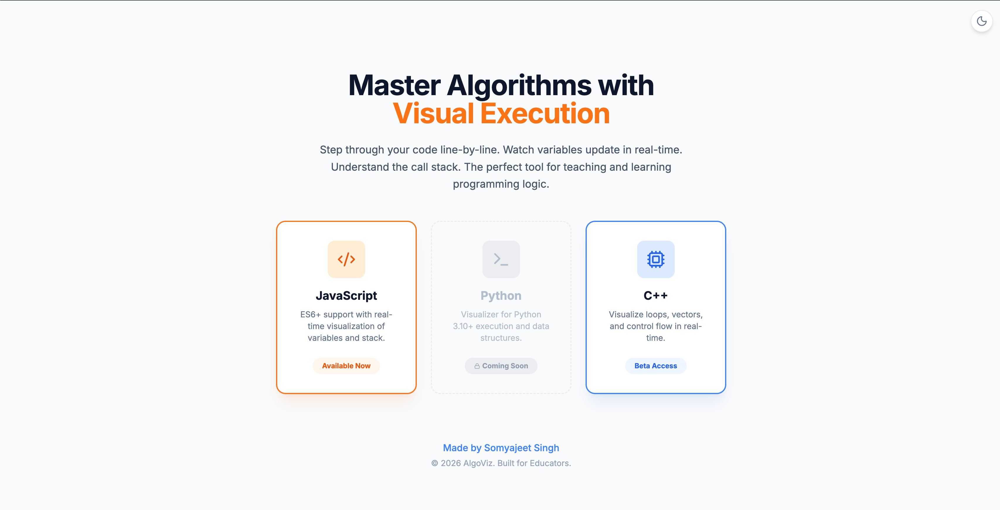
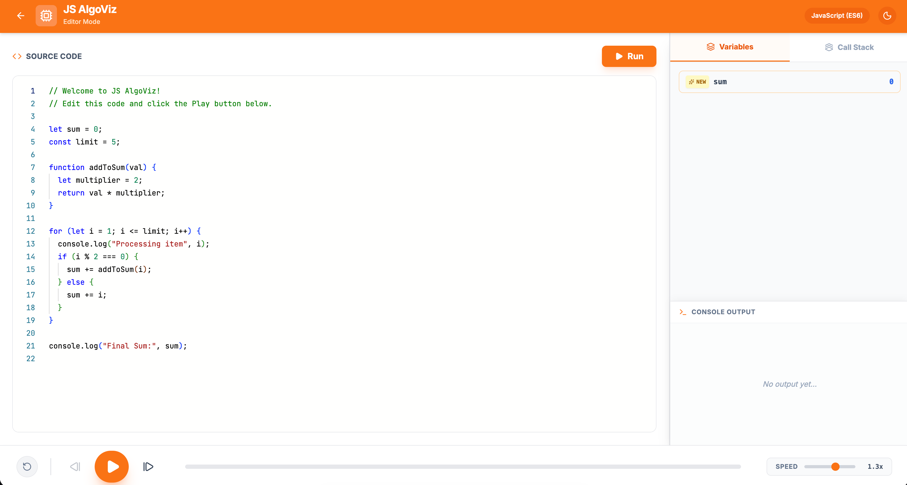

<div align="center">

# ⚡ AlgoViz

### Master Algorithms with Visual Execution

**Step through your code line-by-line. Watch variables update in real-time. Understand the call stack.**


[](https://github.com/ssgamingop)
[](.)
[](.)
[](.)
[](.)
[](.)

</div>

---

## 🎯 What is AlgoViz?

**AlgoViz** is an interactive code execution visualizer built for educators and students. Write code in **JavaScript** or **C++**, hit **Run**, and watch the execution unfold step-by-step — variables changing, the call stack growing, and console output appearing — all in real-time.

It's the perfect companion for:
- 📚 **Learning DSA** — Visualize how sorting algorithms, recursion, and loops actually work
- 🎓 **Teaching programming** — Show students exactly what happens under the hood
- 🐛 **Debugging logic** — Step forward and backward to find where things go wrong

<div align="center">

### 🏠 Home Page


### 🖥️ Editor View


</div>

---

## ✨ Features

| Feature | Description |
|---|---|
| 🔬 **Step-by-step execution** | Play, pause, step forward/backward through every line |
| 📊 **Live variable panel** | See all variables update in real-time with change indicators (↑↓), new badges, and loop detection |
| 📚 **Call stack visualization** | Watch functions push and pop from the call stack |
| 💻 **Console output** | See `console.log` / `cout` output appear at each step |
| 🎨 **Monaco Editor** | Full-featured code editor with syntax highlighting (same editor as VS Code) |
| 🌙 **Dark mode** | Toggle between light and dark themes |
| ⏩ **Speed control** | Adjust execution speed from slow-motion to fast |
| 🟧 **JavaScript (ES6+)** | Full support for modern JavaScript with functions, closures, arrays, objects |
| 🔵 **C++ (Beta)** | Transpiles C++ to JS for visualization — supports loops, vectors, cout, and more |

---

## 🏗️ How It Works

AlgoViz uses a clever **3-stage pipeline** to turn your code into an interactive visualization:

```
┌──────────────┐     ┌──────────────────┐     ┌──────────────────┐     ┌──────────────┐
│  Your Code   │────▶│  C++ Transpiler   │────▶│  JS Instrumenter │────▶│  Sandbox     │
│  (JS or C++) │     │  (if C++ mode)    │     │  (AST via Acorn) │     │  Executor    │
└──────────────┘     └──────────────────┘     └──────────────────┘     └──────────────┘
                                                                             │
                                                                             ▼
                                                                       ┌──────────────┐
                                                                       │  Timeline    │
                                                                       │  (snapshots) │
                                                                       └──────┬───────┘
                                                                              │
                                                                              ▼
                                                                       ┌──────────────┐
                                                                       │  React UI    │
                                                                       │  (step view) │
                                                                       └──────────────┘
```

### Stage 1: Transpilation (C++ only)
If you're writing C++, the **C++ Transpiler** (`cppTranspiler.ts`) converts your C++ code into equivalent JavaScript using regex-based pattern matching. It handles:
- `#include` removal, `using namespace std` cleanup
- Type declarations (`int`, `float`, `string`, etc.) → `let`/`const`
- `vector<int>` → JavaScript arrays
- `cout << x << endl` → `console.log(x)`
- `push_back()`, `.size()`, `.empty()` → JS equivalents

### Stage 2: Instrumentation
The **Instrumenter** (`instrumenter.ts`) parses the JavaScript code into an AST using [Acorn](https://github.com/acornjs/acorn) and injects tracing calls:
- `__tracer.step(line, variables)` after every statement
- `__tracer.enter(name)` / `__tracer.exit()` for function calls
- `__tracer.checkLoop()` for infinite loop protection (max 2000 steps)

### Stage 3: Sandboxed Execution
The **Executor** (`executor.ts`) runs the instrumented code inside a sandboxed `Function()` and collects a **Timeline** — an array of snapshots, each containing:
- Current line number
- All variable values (deep-cloned)
- The call stack
- Console output up to that point

### Stage 4: Visualization
The React frontend steps through the Timeline, highlighting the active line in the Monaco editor, animating variable changes in the **Variables Panel**, showing the **Call Stack**, and streaming **Console Output**.

---

## 🗂️ Project Structure

```
algoviz/
├── App.tsx                          # Main React app (home  + editor views)
├── index.tsx                        # React entry point
├── index.html                       # HTML shell with Tailwind config
├── types.ts                         # TypeScript interfaces
├── vite.config.ts                   # Vite build configuration
├── package.json                     # Dependencies
│
├── backend/
│   ├── sandbox/
│   │   ├── cppTranspiler.ts         # C++ → JavaScript transpiler
│   │   └── executor.ts              # Sandboxed code execution engine
│   └── tracer/
│       └── instrumenter.ts          # AST-based JS code instrumenter
│
├── frontend/
│   └── components/
│       ├── HomePage.tsx             # Landing page with language selection
│       ├── CodeEditor.tsx           # Monaco editor wrapper
│       ├── VariablesPanel.tsx       # Live variable visualization
│       ├── CallStackPanel.tsx       # Call stack display
│       ├── ConsolePanel.tsx         # Console output panel
│       └── Controls.tsx             # Playback controls (play/pause/step)
│
└── assets/                          # Screenshots for README
```

---

## 🚀 Getting Started

### Prerequisites
- [Node.js](https://nodejs.org/) (v18+)

### Installation

```bash
# Clone the repository
git clone https://github.com/ssgamingop/algoviz.git
cd algoviz

# Install dependencies
npm install

# Start the development server
npm run dev
```

The app will be running at **http://localhost:3000** 🎉

### Build for Production

```bash
npm run build
npm run preview
```

---

## 🛠️ Tech Stack

| Technology | Purpose |
|---|---|
| **React 19** | UI framework |
| **TypeScript** | Type safety |
| **Vite** | Build tool & dev server |
| **Monaco Editor** | Code editor (same as VS Code) |
| **Acorn** | JavaScript AST parser for instrumentation |
| **Framer Motion** | Smooth animations |
| **Lucide React** | Icons |
| **Tailwind CSS** | Styling (via CDN) |
| **Python** | Logic & Transpiler (Added by Fork) |

---

## 📝 Usage

1. **Select a language** — Choose JavaScript or C++ (Beta) from the home page
2. **Write your code** — Use the Monaco editor on the left
3. **Click Run** — The code gets instrumented and executed
4. **Step through** — Use the playback controls to go forward/backward through each line
5. **Watch variables** — The right panel shows all variables, with ↑↓ indicators for changes and ✨ badges for new variables
6. **Check the stack** — Switch to the "Call Stack" tab to see function frames
7. **Read console output** — The bottom panel shows all `console.log` / `cout` output

---

## 🤝 Contributing

Contributions are welcome! Feel free to:
- 🐛 Report bugs via [Issues](https://github.com/ssgamingop/algoviz/issues)
- 💡 Suggest features
- 🔧 Submit pull requests

---

## 📄 License

This project is open source and available under the [MIT License](LICENSE).

---

<div align="center">

**Built with ❤️ by [Somyajeet](https://github.com/ssgamingop)** <br/>
**Forked & Python added by [escabyte](.)**

*© 2026 AlgoViz. Built for Educators.*

</div>
